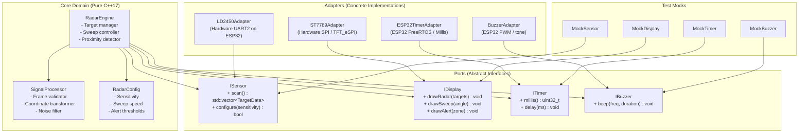

# Hexagonal Architecture Overview

```mermaid
flowchart TD
    subgraph CoreDomain["Core Domain (Pure C++17)"]
        RadarEngine["RadarEngine\n- Target manager\n- Sweep controller\n- Proximity detector"]
        SignalProcessor["SignalProcessor\n- Frame validator\n- Coordinate transformer\n- Noise filter"]
        Config["RadarConfig\n- Sensitivity\n- Sweep speed\n- Alert thresholds"]
    end

    subgraph Ports["Ports (Abstract Interfaces)"]
        ISensor["ISensor\n+ scan() : std::vector&lt;TargetData&gt;\n+ configure(sensitivity) : bool"]
        IDisplay["IDisplay\n+ drawRadar(targets) : void\n+ drawSweep(angle) : void\n+ drawAlert(zone) : void"]
        ITimer["ITimer\n+ millis() : uint32_t\n+ delay(ms) : void"]
        IBuzzer["IBuzzer\n+ beep(freq, duration) : void"]
    end

    subgraph Adapters["Adapters (Concrete Implementations)"]
        LD2450["LD2450Adapter\n(Hardware UART2 on ESP32)"]
        ST7789["ST7789Adapter\n(Hardware SPI / TFT_eSPI)"]
        ESP32Timer["ESP32TimerAdapter\n(ESP32 FreeRTOS / Millis)"]
        PiezoBuzzer["BuzzerAdapter\n(ESP32 PWM / tone)"]
    end

    subgraph TestDoubles["Test Mocks"]
        MockSensor["MockSensor"]
        MockDisplay["MockDisplay"]
        MockTimer["MockTimer"]
        MockBuzzer["MockBuzzer"]
    end

    RadarEngine --> ISensor
    RadarEngine --> IDisplay
    RadarEngine --> ITimer
    RadarEngine --> IBuzzer
    RadarEngine --> SignalProcessor
    RadarEngine --> Config

    LD2450 --> ISensor
    ST7789 --> IDisplay
    ESP32Timer --> ITimer
    PiezoBuzzer --> IBuzzer

    MockSensor --> ISensor
    MockDisplay --> IDisplay
    MockTimer --> ITimer
    MockBuzzer --> IBuzzer
```
