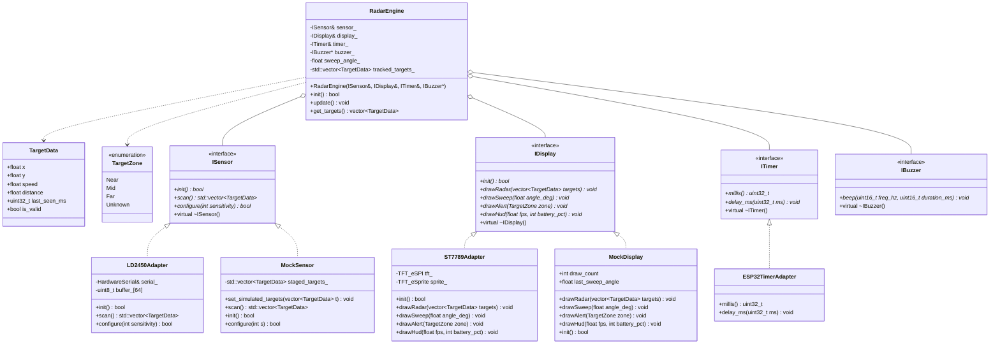

# Class Hierarchy & Interfaces

```mermaid
classDiagram
    class TargetData {
        +float x
        +float y
        +float speed
        +float distance
        +uint32_t last_seen_ms
        +bool is_valid
    }

    class TargetZone {
        <<enumeration>>
        Near
        Mid
        Far
        Unknown
    }

    class ISensor {
        <<interface>>
        +init() bool*
        +scan() std::vector~TargetData~*
        +configure(int sensitivity) bool*
        +virtual ~ISensor()
    }

    class IDisplay {
        <<interface>>
        +init() bool*
        +drawRadar(vector~TargetData~ targets) void*
        +drawSweep(float angle_deg) void*
        +drawAlert(TargetZone zone) void*
        +drawHud(float fps, int battery_pct) void*
        +virtual ~IDisplay()
    }

    class ITimer {
        <<interface>>
        +millis() uint32_t*
        +delay_ms(uint32_t ms) void*
        +virtual ~ITimer()
    }

    class IBuzzer {
        <<interface>>
        +beep(uint16_t freq_hz, uint16_t duration_ms) void*
        +virtual ~IBuzzer()
    }

    class LD2450Adapter {
        -HardwareSerial& serial_
        -uint8_t buffer_[64]
        +init() bool
        +scan() std::vector~TargetData~
        +configure(int sensitivity) bool
    }

    class ST7789Adapter {
        -TFT_eSPI tft_
        -TFT_eSprite sprite_
        +init() bool
        +drawRadar(vector~TargetData~ targets) void
        +drawSweep(float angle_deg) void
        +drawAlert(TargetZone zone) void
        +drawHud(float fps, int battery_pct) void
    }

    class ESP32TimerAdapter {
        +millis() uint32_t
        +delay_ms(uint32_t ms) void
    }

    class MockSensor {
        -std::vector~TargetData~ staged_targets_
        +set_simulated_targets(vector~TargetData~ t) void
        +scan() std::vector~TargetData~
        +init() bool
        +configure(int s) bool
    }

    class MockDisplay {
        +int draw_count
        +float last_sweep_angle
        +drawRadar(vector~TargetData~ targets) void
        +drawSweep(float angle_deg) void
        +drawAlert(TargetZone zone) void
        +drawHud(float fps, int battery_pct) void
        +init() bool
    }

    class RadarEngine {
        -ISensor& sensor_
        -IDisplay& display_
        -ITimer& timer_
        -IBuzzer* buzzer_
        -float sweep_angle_
        -std::vector~TargetData~ tracked_targets_
        +RadarEngine(ISensor&, IDisplay&, ITimer&, IBuzzer*)
        +init() bool
        +update() void
        +get_targets() vector~TargetData~
    }

    ISensor <|.. LD2450Adapter
    ISensor <|.. MockSensor
    IDisplay <|.. ST7789Adapter
    IDisplay <|.. MockDisplay
    ITimer <|.. ESP32TimerAdapter

    RadarEngine o-- ISensor
    RadarEngine o-- IDisplay
    RadarEngine o-- ITimer
    RadarEngine o-- IBuzzer
    RadarEngine ..> TargetData
    RadarEngine ..> TargetZone
```
