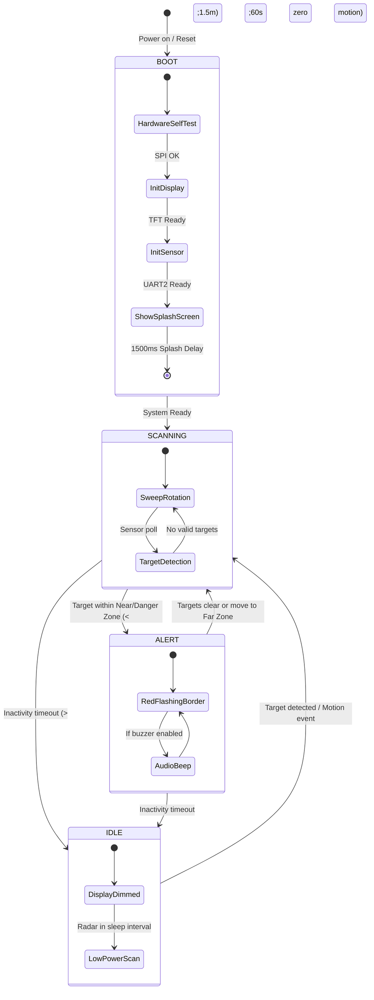

# Radar Engine State Machine

The radar system transitions across distinct states to manage power, display animations, and alert boundaries:

```mermaid
stateDiagram-v2
    [*] --> BOOT: Power on / Reset

    state BOOT {
        [*] --> HardwareSelfTest
        HardwareSelfTest --> InitDisplay: SPI OK
        InitDisplay --> InitSensor: TFT Ready
        InitSensor --> ShowSplashScreen: UART2 Ready
        ShowSplashScreen --> [*]: 1500ms Splash Delay
    }

    BOOT --> SCANNING: System Ready

    state SCANNING {
        [*] --> SweepRotation
        SweepRotation --> TargetDetection: Sensor poll
        TargetDetection --> SweepRotation: No valid targets
    }

    SCANNING --> ALERT: Target within Near/Danger Zone (&lt;1.5m)
    ALERT --> SCANNING: Targets clear or move to Far Zone

    state ALERT {
        [*] --> RedFlashingBorder
        RedFlashingBorder --> AudioBeep: If buzzer enabled
        AudioBeep --> RedFlashingBorder
    }

    SCANNING --> IDLE: Inactivity timeout (&gt;60s zero motion)
    ALERT --> IDLE: Inactivity timeout

    state IDLE {
        [*] --> DisplayDimmed
        DisplayDimmed --> LowPowerScan: Radar in sleep interval
    }

    IDLE --> SCANNING: Target detected / Motion event
```
